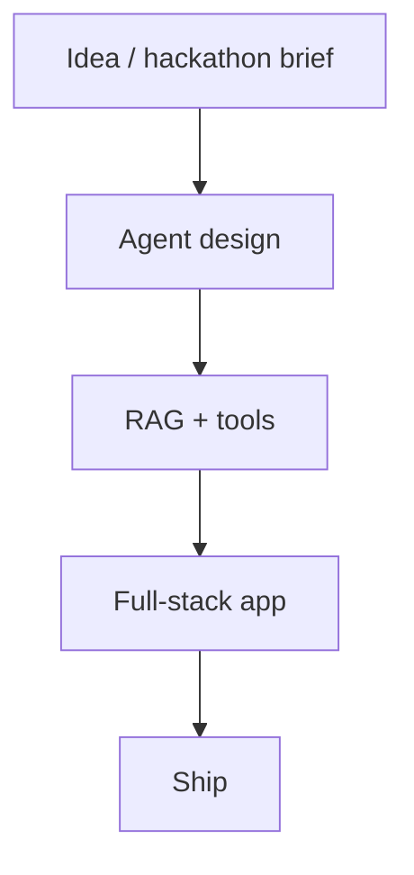

<div align="center">


<br/>

[**About**](#-about) · [**Now**](#-currently-building) · [**Stack**](#-stack) · [**Projects**](#-projects) · [**Connect**](#-connect)

</div>

<br/>

<div align="center">


</div>

<br/>

## 👋 About

I'm an **AI/ML and full-stack engineer** who builds agentic AI systems, multi-agent pipelines, RAG architectures and the full-stack apps around them. I like turning an idea into something people can click on, and I build for hackathons and competitive submissions often, so I'm used to shipping fast and demoing well.

Outside of code: photography, and competitive programming (DSA drills and contest nights).

<div align="center">

[](mailto:alenthomas1809@gmail.com)
[](https://www.linkedin.com/in/alen-thomas-3558bb187/)
[](https://portfolio-website-alpha-nine-69.vercel.app/)
[](https://github.com/AIstar007)

</div>

## 🔭 Currently building

- 🧩 **Dynamic UI with voice** — a Next.js + CopilotKit playground where an agent drives the interface, with Sarvam voice input
- 🤖 **AI PR review on the Microsoft Agent Framework** — migrating a GitHub Actions AI pull-request review system into MAF
- 🏁 Hackathon builds: agentic pipelines and RAG apps, shipped fast

> 🔥 **Open to collaborations, freelance projects and consulting work.** If you have an agentic-AI or full-stack problem, email me.

## ⚡ Developer Matrix

```yaml
alen_thomas:
  role: "AI/ML & Full-Stack Engineer"
  focus: ["Agentic AI systems", "Multi-agent pipelines", "RAG architectures", "Full-stack apps"]
  also_builds: ["Computer Vision", "NLP", "Android (Kotlin/Java) with ML Kit & Firebase"]
  cloud: ["AWS", "GCP", "Azure"]            # serverless & containerization
  mission: "Revolutionizing user experiences with an AI-first approach"
  impact: "Scalable solutions for real-world problems"
  principles:
    - "Simplicity is the ultimate sophistication"
    - "Code is poetry, architecture is art"
    - "User experience trumps technical complexity"
```

## 🛠️ Stack

<div align="center">


</div>

<details>
<summary><b>Full technology list</b></summary>

<div align="center">

### 💻 Programming languages


### 🧠 AI/ML frameworks


### ☁️ Cloud & infrastructure


### 📱 Mobile & web


</div>

</details>

## 🪪 Dev ID

<div align="center">


</div>

<details>
<summary><b>More live stats</b></summary>

<div align="center">


</div>

</details>

## 🚀 Projects

🌐 **Full interactive experience:** [portfolio-website-alpha-nine-69.vercel.app](https://portfolio-website-alpha-nine-69.vercel.app/)

| Project | What it is | Stack |
| :-- | :-- | :-- |
| **Dynamic UI with Voice Integration** | A dynamic-UI playground where an agent drives the interface, with voice input via Sarvam | Next.js, CopilotKit |
| **AI PR review → Microsoft Agent Framework** | Migrating a GitHub Actions AI pull-request review system onto the Microsoft Agent Framework | Python, GitHub Actions, MAF |

<!-- TODO: link each project to its repo, and add more rows. -->

### What I build

| 🤖 Agentic AI & ML | ☁️ Cloud architecture | 📱 Mobile | 🌐 Full-stack |
| :-- | :-- | :-- | :-- |
| Multi-agent pipelines | Microservices | Native Android | RESTful API design |
| RAG architectures | Serverless computing | ML Kit integration | Database architecture |
| Computer vision & NLP | Container orchestration | Firebase backend | Frontend frameworks |
| Real-time ML inference | Auto-scaling & caching | Material Design | Authentication & security |

### How an idea ships



### My contributions as a city

<div align="center">


</div>

## 🤝 Connect

<div align="center">


*"Innovation is seeing what everybody has seen and thinking what nobody else has thought."*

⭐ If you found value here, star my repositories and let's build the future together.

</div>
